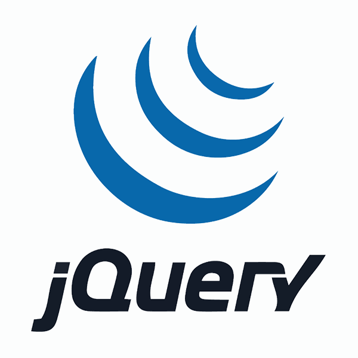

<h3 align="center">A passionate frontend developer from Cork, Ireland</h3>

  

<h2>Summary of Experience</h2>

I have recently completed a Full-Stack Software Development course with Code Institute. I have gained advanced skills in HTML, CSS, JavaScript, jQuery, PHP, SQL, Python, and Django. I am passionate about web development and have decided to pursue a career as a remote web developer. I hold a BA Honours degree in Multimedia, which has equipped me with diverse skills in graphic design, software engineering, web development, filmmaking, video editing, and animation. I discovered my project management strengths during my studies, further enhancing my skills.

Next month, I am excited to participate in team hackathons to develop my remote work skills further. I am committed to learning and growing in a remote work environment and have enrolled in Remote Work Ready at Growth Remote online.
 

However, I would need an ISL interpreter to ensure effective communication during meetings, consultations, and team meetings. I am eager to contribute my best to the team. For more information about Sign Language Interpreting Services (SLIS), please visit https://slis.ie/contact/.

Please take a look at my portfolio and development projects on my website at https://robert-quinlan-resume-c64b50165280.herokuapp.com/.

<h3 align="left">Connect with me:</h3>

<h3 align="left">Languages and Tools:</h3>

  
  

  
 

 

 

 

 

 

 

 

 

 

 

&nbsp;

