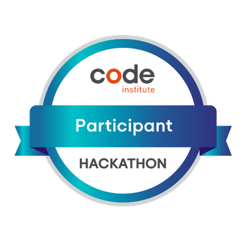

Hi My name is Robert Quinlan
======================================================================================================================================

Junior Frontend & Backend Web Developer
---------------------------------------

I hold an honours degree in BA Multimedia, which has given me an in-depth understanding of project management and software & hardware development. I have also completed a full-stack software development course online at Code Institute, where I gained expertise in HTML, CSS, JavaScript, jQuery, Python, SQL, PHP, and Django. I am particularly interested in designing UX/UI for the accessibility range of disability needs/wants, ensuring that websites are friendly and interactive for everyone. I have included a link to my portfolio website, where you can find examples of my previous work and experiences. Please note that my portfolio video site does not have audio, but I worked with a former colleague to create audio, which I combined into an animation film that showcases my skills.

* 🌍  I'm based in Cork, Ireland
* 🖥️  See my portfolio at [Robert's Portfolios](http://robert-quinlan-resume-c64b50165280.herokuapp.com/)
* ✉️  You can contact me at [quinlanrobert@yahoo.com](mailto:quinlanrobert@yahoo.com)

### Skills

### Socials

 <a href="https://www.github.com/RQISL" target="_blank" rel="noreferrer"> <picture> <source media="(prefers-color-scheme: dark)" srcset="https://raw.githubusercontent.com/danielcranney/readme-generator/main/public/icons/socials/github-dark.svg" /> <source media="(prefers-color-scheme: light)" srcset="https://raw.githubusercontent.com/danielcranney/readme-generator/main/public/icons/socials/github.svg" />  </picture> </a> <a href="https://www.linkedin.com/in/full-stack-software-development/" target="_blank" rel="noreferrer"> <picture> <source media="(prefers-color-scheme: dark)" srcset="https://raw.githubusercontent.com/danielcranney/readme-generator/main/public/icons/socials/linkedin-dark.svg" /> <source media="(prefers-color-scheme: light)" srcset="https://raw.githubusercontent.com/danielcranney/readme-generator/main/public/icons/socials/linkedin.svg" />  </picture> </a>

### Badges

<b>August 2024 Hackathon: Participant Adwarded<b>

<blockquote class="badgr-badge" style="font-family: Helvetica, Roboto, &quot;Segoe UI&quot;, Calibri, sans-serif; background-color: white">
August 2024 Hackathon: Participant

<strong style="font-size: 12px; font-weight: bold; font-style: normal; font-stretch: normal; line-height: 1.67; letter-spacing: normal; text-align: left; color: #000;">Awarded: </strong>20 Aug 2024

<strong style="font-size: 12px; font-weight: bold; font-style: normal; font-stretch: normal; line-height: 1.67; letter-spacing: normal; text-align: left; color: #000;">Awarded To: </strong> Robert Quinlan
</blockquote>
 
<b>My GitHub Stats</b>

 

